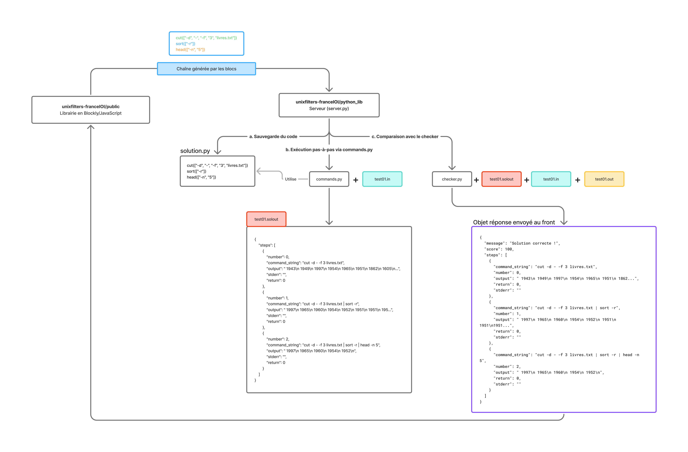

# Documentation du checker

Ce projet permet d'évaluer le code envoyé depuis l'[interface](https://github.com/UnixFilters/unixfilters-franceIOI/tree/main), en comparant la sortie produite par le code avec une sortie attendue.

## Déroulement

Le serveur utilise le checker pour exécuter deux étapes principales :

- Sauvegarder le code envoyé par le front
- Exécuter la solution avec la librairie commands.py et mettre le résultat dans test01.solout
- Exécuter test01.solout avec le résultat attendu et envoyer au front l'objet de réponse (message + score + steps)



## Arborescence

```bash
.
├── blocklyUnixFilters_lib.js
├── docs
│ ├── documentation_checker.md
│ └── documentation_checker.py
├── exemple_checker
│ └── tests
│  ├── copie de la librairie blockly
│  │ └── ...
│  ├── files
│  │ ├── test01.in # Fichier pris en entrée par le checker
│  │ ├── test01.out # JSON obtenu après exécution du code
│  │ └── test01.solout # Résultat attendu (corrigé)
│  └── gen
│    ├── checker.py # Logique permettant d'évaluer le score et renvoyer le feedback
│    ├── commands.py # Librairie exécutant les commandes
│    ├── livres.txt # Exemple de fichier d'entrée
│    └── solution.py # Contient le code généré par les blocs
├── index.css
├── index.html
├── jsongenerator.js
├── task.js
└── unixfilters.js
```

## Détails du fonctionnement

Le serveur `server.py` dans le projet unixfilters-franceIOI reçoit le code depuis l'interface frontend.
Il va ensuite :

### a. Sauvegarder le code dans `solution.py``

**Exemple :**
Les blocs ont généré la commande :

```python
cut(["-d","-","-f","3","livres.txt"])

sort(["-r"])

head(["-n","5"])
```

En cliquant sur `Exécuter` côté front, le code est envoyé au serveur.

Le serveur écrit dans le fichier solution.py :

```python title="solution.py"
cut(["-d","-","-f","3","livres.txt"])

sort(["-r"])

head(["-n","5"])
```

### b. Exécution via commands.py

Le serveur appelle commands.py, qui va exécuter le code. Le résultat, sous forme d'objet JSON (steps) est stocké dans `test01.solout`.

**Exemple :**

```python title="commands.py"
try:
    # Exécution de la librairie avec le code généré dans solution.py
    solution_path = os.path.join(os.path.dirname(__file__), "solution.py")
    with open(solution_path, "r") as f:
        code = compile(f.read(), solution_path, "exec")
        exec(code)
except:
    # Reste du code

# Afficher les steps
print(json.dumps(get_output(), indent=4))
```

```txt title="test01.solout"
{
    "steps": [
        {
            "number": 0,
            "command_string": "cut -d - -f 3 livres.txt",
            "output": " 1943\n 1949\n 1997\n 1954\n 1965\n 1951\n 1862\n 1605\n 1851\n 1844\n 1947\n 1951\n 1915\n 1857\n 1922\n 1952\n 1932\n 1960\n 1847\n 1897\n 1818\n 1951\n",
            "stderr": "",
            "return": 0
        },
        {
            "number": 1,
            "command_string": "cut -d - -f 3 livres.txt | sort -r",
            "output": " 1997\n 1965\n 1960\n 1954\n 1952\n 1951\n 1951\n 1951\n 1949\n 1947\n 1943\n 1932\n 1922\n 1915\n 1897\n 1862\n 1857\n 1851\n 1847\n 1844\n 1818\n 1605\n",
            "stderr": "",
            "return": 0
        },
        {
            "number": 2,
            "command_string": "cut -d - -f 3 livres.txt | sort -r | head -n 5",
            "output": " 1997\n 1965\n 1960\n 1954\n 1952\n",
            "stderr": "",
            "return": 0
        }
    ]
}
```

### c. Vérification avec `checker.py`

Le serveur appelle ensuite le checker.py avec trois arguments :

- Le fichier test01.solout
- Le fichier test01.in (fichier d'entrée toujours vide)
- Le fichier test01.out (qui contient la réponse attendue)

Le checker compare la réponse générée (` test01.solout`) et la réponse attendue (`test01.out`), en supprimant les espaces et retour à la ligne.

#### Évaluation

- Si sortie générée = sortie attendue → score = 100 + message de succès + steps
- Si la sortie ne correspond pas → score = 0 + message d'échec + steps
- Si une des étapes échoue → score = 0 + message d'erreur + steps

Un objet `result` est construit et renvoyé à l’interface.

**Exemple :**

```json
{
  "message": "Solution correcte !",
  "score": 100,
  "steps": [
    {
      "command_string": "cut -d - -f 3 livres.txt",
      "number": 0,
      "output": " 1943\n 1949\n 1997\n 1954\n 1965\n 1951\n 1862...",
      "return": 0,
      "stderr": ""
    },
    {
      "command_string": "cut -d - -f 3 livres.txt | sort -r",
      "number": 1,
      "output": " 1997\n 1965\n 1960\n 1954\n 1952\n 1951\n 1951\n1951...",
      "return": 0,
      "stderr": ""
    },
    {
      "command_string": "cut -d - -f 3 livres.txt | sort -r | head -n 5",
      "number": 2,
      "output": " 1997\n 1965\n 1960\n 1954\n 1952\n",
      "return": 0,
      "stderr": ""
    }
  ]
}
```
