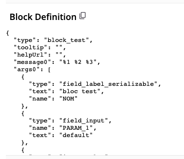

# Ajouter un bloc

## Ajouter un bloc COMMAND

### 1. Générer le bloc

- Dans [blocklyUnixFilters_lib.js](https://github.com/UnixFilters/unixfilters-franceIOI/blob/main/public/blocklyUnixFilters_lib.js), ajouter la commande à la liste `COMMANDS` dans sa catégorie :

**Exemple :** Pour ajouter une commande nommée `exemple`, il faut ajouter son nom, tooltip et format à la liste.

```javascript title="blocklyUnixFilters_lib.js"
const COMMANDS = [
  {
    commandName: "cat",
    tooltip: "Concatène et affiche le contenu d'un fichier",
    format: "cat [options] fichier",
  },
  // Autres commandes
  {
    commandName: "exemple",
    tooltip: "Exemple de documentation",
    format: "exemple [options]",
  },
];
```

- Dans le fichier `unixfilters`, ajouter la commande dans [`optionTooltips`](https://github.com/UnixFilters/unixfilters-franceIOI/blob/main/public/unixfilters.js#L375) **même si elle ne possède pas d'options**.

**Exemple :**

```javascript title="unixfilters.js"
const optionTooltips = {
  cat: {},
  exemple:{}
// Autres commandes
```

(Pour ajouter des options, voir la [section suivante](#ajouter-un-bloc-option).)

Le bloc sera ensuite créé grâce à la fonction [makeCommandBlock](https://github.com/UnixFilters/unixfilters-franceIOI/blob/main/public/blocklyUnixFilters_lib.js#L423).

### 2. Ajouter le bloc à la tâche

Dans le fichier [`task.js`](https://github.com/UnixFilters/unixfilters-franceIOI/blob/main/public/task.js), ajouter le nom du bloc. L'ordre du fichier correspond à l'ordre des blocs dans la boîte à outils quand elle n'est pas triée. Le bloc sera nommé ainsi : `nomdelacommande`

**Exemple :**

```javascript title="task.js"
function initTask(subTask) {
    includeBlocks: {
        generatedBlocks: {
            unixfilters: [
                "cat",
                "exemple"
            ],
        },
...
```

AJOUTER A CATEGORIES
AJOUTER A LABEL

AJOUTER A JSONGENERATOR

### Catégorie

Par défaut, chaque commande est dans sa propre catégorie lorsque la boîte à outils est triée par catégorie.
Pour créer une catégorie particulière, voir la documentation sur [Créer une catégorie](./create_category.md).

### Remarque

Lors de l'ajout d'une commande, il ne faut pas oublier de créer sa fonction correspondante dans le fichier commands.py (voir [Ajouter une commande](./add_command.md)).

## Ajouter un bloc OPTION

Chaque option (comme `-c`, `-b`…) génère un bloc à partir d’une structure définie dans [`unixfilters.js`](https://github.com/UnixFilters/unixfilters-franceIOI/blob/main/public/unixfilters.js#L375).

Lorsque vous ajoutez une option, vous devez spécifier un **type**.

| Type          | Description                                                              | Exemple                                    |
| ------------- | ------------------------------------------------------------------------ | ------------------------------------------ |
| `flag`        | Pas de paramètre à remplir, juste un bloc avec une entrée et une sortie. |         |
| `field_index` | Affiche un **input** pour saisir un numéro de champ ou un délimiteur.    |  |

### 1. Générer le bloc

Pour que la librairie puisse générer ce bloc, il faut :

Dans le fichier `unixfilters.js`, ajouter l’option sous la commande dans [`optionTooltips`](https://github.com/UnixFilters/unixfilters-franceIOI/blob/main/public/unixfilters.js#L375).

**Exemple :** Pour ajouter l'option _inventée_ -x\[FIELD_INDEX\], il faut ajouter sa lettre (x), son type (field index) et son tooltip (indication qui sera affichée lorsqu'on passe la souris sur le bloc) avec la commande correspondante, on prend l'exemple de tail ici.

```javascript title="unixfilters.js"
const optionTooltips = {
  // Autres commandes
  tail: {
    n: {
      field_index: "tail : afficher les n dernières lignes (par défaut : 10)",
    },
    c: { field_index: "tail : afficher les n derniers octets" },
    x: { field_index: "tail : affiche x" }, // Ajout de la nouvelle option x
  },
};
```

Le bloc sera créé automatiquement grâce à la fonction [`makeOptionBlock`](https://github.com/UnixFilters/unixfilters-franceIOI/blob/main/public/blocklyUnixFilters_lib.js#L343).

### 2. Ajouter le bloc à la tâche

Pour que le bloc soit affiché dans la tâche, il faut dans le fichier [`task.js`](https://github.com/UnixFilters/unixfilters-franceIOI/blob/main/public/task.js), ajouter le nom du bloc.

Le bloc sera nommé ainsi : `option_<lettre>_<type>`où le type peut être flag/field_index.

**Exemple :**

```javascript title="task.js"
function initTask(subTask) {
    includeBlocks: {
        generatedBlocks: {
            unixfilters: [
                "option_x_field_index"
            ],
        },
...
```

### Catégorie

- Lorsque la boîte à outils est triée par catégorie : Par défaut, chaque option est affichée dans la catégorie de sa commande correspondante de dans [`optionTooltips`](https://github.com/UnixFilters/unixfilters-franceIOI/blob/main/public/unixfilters.js#L375)

- Sinon : L'ordre du fichier correspond à l'ordre des blocs dans la boîte à outils.

## Ajouter un bloc SYMBOL

### 1. Générer le bloc

Dans le fichier [blocklyUnixFilters_lib.js](https://github.com/UnixFilters/unixfilters-franceIOI/blob/main/public/blocklyUnixFilters_lib.js), ajouter le bloc dans sa catégorie correspondante.

**Exemple :** Pour ajouter le symbole exemple, il faut ajouter son nom, sa couleur et son tooltip.

```javascript title="blocklyUnixFilters_lib.js"
const SYMBOL_NAMES = [
  {
    name: "symbole_exemple",
    colour: 90,
    tooltip: "Exemple de tooltip",
  },
  // Autres symboles
];
```

Le bloc sera créé automatiquement grâce à la fonction [`makeSymbolBlock`](https://github.com/UnixFilters/unixfilters-franceIOI/blob/main/public/blocklyUnixFilters_lib.js#L479).

### 2. Ajouter le bloc à la tâche

Dans le fichier [task.js], ajouter le nom du bloc. L'ordre du fichier correspond à l'ordre des blocs dans la boîte à outils. Le bloc aura ce nommage **symbol_nomdusymbole**

**Exemple :**

```javascript title="task.js"
function initTask(subTask) {
    includeBlocks: {
        generatedBlocks: {
            unixfilters: [
                "cat",
                "symbol_symboleExemple"
            ],
        },
...
```

## Ajouter un nouveau bloc

Si aucune des structures de blocs ne vous convient, vous pouvez ajouter un nouveau bloc. Pour définir un bloc, il existe un [outil Google](https://google.github.io/blockly-samples/examples/developer-tools/index.html) pour créer le bloc visuellement, et récupérer le code généré.

### 1. Créer un bloc

**Exemple** :

Avec l'[outil Google](https://google.github.io/blockly-samples/examples/developer-tools/index.html), créer un bloc et générer sa définition en JSON.


Récupérer la définition du bloc avec un copier-coller.


```json
{
  "type": "block_test",
  "tooltip": "",
  "helpUrl": "",
  "message0": "%1 %2 %3",
  "args0": [
    {
      "type": "field_label_serializable",
      "text": "bloc test",
      "name": "NOM"
    },
    {
      "type": "field_input",
      "name": "PARAM_1",
      "text": "default"
    },
    {
      "type": "input_value",
      "name": "PARAM_0"
    }
  ],
  "output": null,
  "colour": 285
}
```

### 2. Ajouter dans la librairie

Dans le fichier [blocklyUnixFilters_lib.js](https://github.com/UnixFilters/unixfilters-franceIOI/blob/main/public/blocklyUnixFilters_lib.js), la création du bloc peut se faire :

- Avec une définition classique (voir le bloc [text_input](https://github.com/UnixFilters/unixfilters-franceIOI/blob/main/public/blocklyUnixFilters_lib.js#L491))

```javascript title="blocklyUnixFilters_lib.js"
context.customBlocks = {
  unixfilters: {
    inputs: [
      {
        // Bloc existant
      },
      {
        name: "block_test",
        blocklyJson: {
          // On ajoute la définition du bloc ici, en remplaçant le "type" par "name"
          message0: "%1 %2 %3", // Affichage des arguments
          args0: [
            {
              type: "field_label_serializable",
              text: "bloc test",
              name: "NOM",
            },
            // Ajouter un argument text input
            {
              type: "field_input",
              name: "PARAM_1", // nom du paramètre (à laisser car on peut de ce fait réutiliser les fonctions d'extraction)
              text: "default", // texte par défaut dans l'input
            },
            // Ajouter une entrée droite
            {
              type: "input_value",
              name: "PARAM_0",
            },
          ],
          output: null, // Sortie gauche
          colour: 285,
        },
      },
    ],
    commands: [],
    symbols: [],
  },
};
```

Le bloc block_test sera ajouté dans la catégorie "inputs" si la boîte à outils est triée par catégorie.

- Avec une fonction (voir la fonction [makeGrepBlock()](https://github.com/UnixFilters/unixfilters-franceIOI/blob/main/public/blocklyUnixFilters_lib.js#L260)). Cela permet d'ajouter une logique plus complexe.

Pour l'ajouter dans une nouvelle catégorie, il faut en créer une. Voir : [Ajouter une catégorie]()
