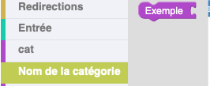
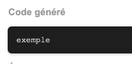

# Ajouter un bloc COMMAND

## 1. Générer le bloc

- Dans [blocklyUnixFilters_lib.js](https://github.com/UnixFilters/unixfilters-franceIOI/blob/main/public/blocklyUnixFilters_lib.js), ajouter la commande à la liste `COMMANDS` dans sa catégorie :

**Exemple :** Pour ajouter une commande nommée `exemple`, il faut ajouter son nom, tooltip et format à la liste.

```javascript title="blocklyUnixFilters_lib.js"
const COMMANDS = [
  {
    commandName: "cat",
    tooltip: "Concatène et affiche le contenu d'un fichier",
    format: "cat [options] fichier",
  },
  // Autres commandes
  {
    commandName: "exemple",
    tooltip: "Exemple de documentation",
    format: "exemple [options]",
  },
];
```

- Dans le fichier `unixfilters`, ajouter la commande dans [`optionTooltips`](https://github.com/UnixFilters/unixfilters-franceIOI/blob/main/public/unixfilters.js#L375) **même si elle ne possède pas d'options**.

**Exemple :**

```javascript title="unixfilters.js"
const optionTooltips = {
  cat: {},
  exemple:{}
// Autres commandes
```

(Pour ajouter des options, voir la [page dédiée](./add_option_block.md).)

Le bloc sera ensuite créé grâce à la fonction [makeCommandBlock](https://github.com/UnixFilters/unixfilters-franceIOI/blob/main/public/blocklyUnixFilters_lib.js#L423).

## 2. Ajouter le bloc à la tâche

Dans le fichier [`task.js`](https://github.com/UnixFilters/unixfilters-franceIOI/blob/main/public/task.js), ajouter le nom du bloc. L'ordre du fichier correspond à l'ordre des blocs dans la boîte à outils quand elle n'est pas triée. Le bloc sera nommé ainsi : `nomdelacommande`

**Exemple :**

```javascript title="task.js"
function initTask(subTask) {
    includeBlocks: {
        generatedBlocks: {
            unixfilters: [
                "cat",
                "exemple"
            ],
        },
...
```

## 3. Ajouter le label du bloc et sa catégorie

Il faut ajouter un label, c'est ce qui est affiché sur le bloc dans l'interface. De plus, comme chaque commande génère sa propre catégorie à son nom, il faut aussi ajouter la commande dans `categories`

**Exemple :**

```javascript hl_lines="5 8"
var getContext = function (display, infos, curLevel) {
  var localLanguageStrings = {
    fr: {
      categories: {
        exemple: "Nom de la catégorie",
      },
      label: {
        exemple: "Exemple",
      },
    },
  };
};
```

Le label sur le bloc sera `Exemple`, et en catégorie, sa catégorie sera `Nom de la catégorie`.


## 4. Ajouter à `jsongenerator.js`

Dans le fichier `jsongenerator.js`, il faut ajouter la génération de code pour la commande. Pour une commande, la génération de code se fait avec la fonction `makeCommandGenerator`, qui va mettre le nom de la commande telle quelle dans le code généré.

**Exemple :**

```javascript title="jsongenerator.js"
// Generates code for commands
// Autres générations
jsonGenerator.exemple = makeCommandGenerator("exemple");
```



Il est possible de générer autre chose que ce comportement par défaut :

```javascript title="jsongenerator.js"
jsonGenerator.exemple = function () {
  return `commande exemple`;
};
```

## Catégorie

Par défaut, chaque commande est dans sa propre catégorie lorsque la boîte à outils est triée par catégorie.
Pour créer une catégorie particulière, voir la documentation sur [Créer une catégorie](./create_category.md).

## Remarque

Lors de l'ajout d'une commande, il ne faut pas oublier de créer sa fonction correspondante dans le fichier commands.py (voir [Ajouter une commande](./add_command.md)).
