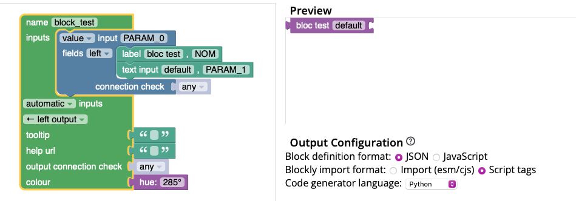
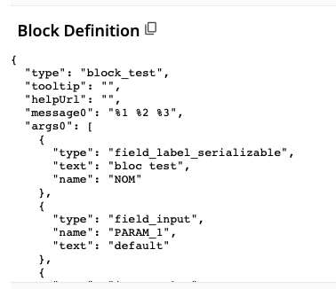

# Ajouter un nouveau bloc

Si aucune des structures de blocs ne vous convient, vous pouvez ajouter un nouveau bloc. Pour définir un bloc, il existe un [outil Google](https://google.github.io/blockly-samples/examples/developer-tools/index.html) pour créer le bloc visuellement, et récupérer le code généré.

## 1. Créer un bloc

**Exemple** :

Avec l'[outil Google](https://google.github.io/blockly-samples/examples/developer-tools/index.html), créer un bloc et générer sa définition en JSON.


Récupérer la définition du bloc avec un copier-coller.


```json
{
  "type": "block_test",
  "tooltip": "",
  "helpUrl": "",
  "message0": "%1 %2 %3",
  "args0": [
    {
      "type": "field_label_serializable",
      "text": "bloc test",
      "name": "NOM"
    },
    {
      "type": "field_input",
      "name": "PARAM_1",
      "text": "default"
    },
    {
      "type": "input_value",
      "name": "PARAM_0"
    }
  ],
  "output": null,
  "colour": 285
}
```

## 2. Ajouter dans la librairie

Dans le fichier [`public/blocklyUnixFilters_lib.js`](https://github.com/UnixFilters/unixfilters-franceIOI/blob/main/public/blocklyUnixFilters_lib.js), la création du bloc peut se faire :

- Avec une définition classique (voir le bloc [`text_input`](https://github.com/UnixFilters/unixfilters-franceIOI/blob/main/public/blocklyUnixFilters_lib.js#L491))

```javascript title="blocklyUnixFilters_lib.js"
context.customBlocks = {
  unixfilters: {
    inputs: [
      {
        // Bloc existant
      },
      {
        name: "block_test",
        blocklyJson: {
          // On ajoute la définition du bloc ici, en remplaçant le "type" par "name"
          message0: "%1 %2 %3", // Affichage des arguments
          args0: [
            {
              type: "field_label_serializable",
              text: "bloc test",
              name: "NOM",
            },
            // Ajouter un argument text input
            {
              type: "field_input",
              name: "PARAM_1", // nom du paramètre (à laisser car on peut de ce fait réutiliser les fonctions d'extraction)
              text: "default", // texte par défaut dans l'input
            },
            // Ajouter une entrée droite
            {
              type: "input_value",
              name: "PARAM_0",
            },
          ],
          output: null, // Sortie gauche
          colour: 285,
        },
      },
    ],
    commands: [],
    symbols: [],
  },
};
```

Le bloc block_test sera ajouté dans la catégorie "inputs" si la boîte à outils est triée par catégorie.

- Avec une fonction (voir la fonction [`makeGrepBlock()`](https://github.com/UnixFilters/unixfilters-franceIOI/blob/main/public/blocklyUnixFilters_lib.js#L260)). Cela permet d'ajouter une logique plus complexe.

Pour l'ajouter dans une nouvelle catégorie, il faut en créer une. Voir : [Ajouter une catégorie](./create_category.md)
