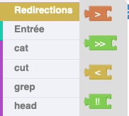

# Ajouter un bloc SYMBOL

## 1. Générer le bloc

Dans le fichier [`public/blocklyUnixFilters_lib.js`](https://github.com/UnixFilters/unixfilters-franceIOI/blob/main/public/blocklyUnixFilters_lib.js), ajouter le bloc dans sa catégorie correspondante.

**Exemple :** Pour ajouter le symbole exemple, il faut ajouter son nom, sa couleur et son tooltip.

```javascript title="blocklyUnixFilters_lib.js"
const SYMBOL_NAMES = [
  {
    name: "symbol_symboleExemple[]",
    colour: 90,
    tooltip: "Exemple de tooltip",
  },
  // Autres symboles
];
```

Le bloc sera créé automatiquement grâce à la fonction [`makeSymbolBlock`](https://github.com/UnixFilters/unixfilters-franceIOI/blob/main/public/blocklyUnixFilters_lib.js#L479).

## 2. Ajouter le bloc à la tâche

Dans le fichier [`public/task.js`](https://github.com/UnixFilters/unixfilters-franceIOI/blob/main/public/task.js), ajouter le nom du bloc. L'ordre du fichier correspond à l'ordre des blocs dans la boîte à outils. Le bloc aura ce nommage **symbol_nomdusymbole**

**Exemple :**

```javascript title="task.js"
function initTask(subTask) {
    includeBlocks: {
        generatedBlocks: {
            unixfilters: [
                "cat",
                "symbol_symboleExemple"
            ],
        },
```

## 3. Ajouter le label du bloc

Il faut ajouter un label, c'est ce qui est affiché sur le bloc dans l'interface.

**Exemple :**

```javascript hl_lines="5 8"
var getContext = function (display, infos, curLevel) {
  var localLanguageStrings = {
    fr: {
      categories: {
        // Catégories
      },
      label: {
        symbol_symboleExemple: "!!",
      },
    },
  };
};
```

Le label sur le bloc sera `!!`.

