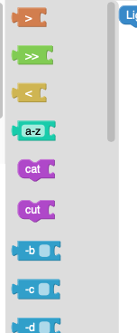

# Créer une tâche

Cette documentation explique comment créer une tâche pour le projet **UnixFilters**, en suivant les étapes :

- ajouter les blocs
- modifier l’énoncé
- configurer les fichiers de test
- vérifier la solution

## Ajouter des blocs à une tâche

Dans **unixfilters** :
Les blocs sont configurés dans le fichier [`public/task.js`](https://github.com/UnixFilters/unixfilters-franceIOI/blob/main/public/task.js). Il contient les blocs que l’utilisateur pourra manipuler dans l’interface.

La liste des blocs existants est [ici](./list_blocks.md).

**Exemple :**

```javascript title="task.js"
function initTask(subTask) {
  subTask.gridInfos = {
    hideSaveOrLoad: false,
    conceptViewer: false,
    actionDelay: 200,

    includeBlocks: {
      groupByCategory: false, // ou true selon le besoin

      generatedBlocks: {
        unixfilters: [
          // Ajouter ici les noms des blocs autorisés (ex : "cat", "grep", "sort")
        ],
      },
    },
    // Autres paramètres
  };
}
```

(AJOUTER FORMAT NOMS BLOCS OPTION)

### `groupByCategory`

L'option groupByCategory indique si les blocs sont affichés groupés par type de commande ou en vrac :

**Exemple :**

| `groupByCategory: true`             | `groupByCategory: false`             |
| ----------------------------------- | ------------------------------------ |
|  |  |

### Compatibilité des blocs

Chaque option est associée à une commande principale (comme `grep`, `sed`, etc.), mais peut être utilisée avec d’autres si elle est compatible.

**Exemple :**
Le bloc `option_i_flag_grep` est conçu pour `grep`, mais fonctionne aussi avec `sed` :
`option_i_flag_sed`.

La liste des compatibilités est disponible dans le fichier `public/unixfilters.js` dans le dictionnaire [`optionTooltips`](https://github.com/UnixFilters/unixfilters-franceIOI/blob/main/public/unixfilters.js#L375)

## Modifier l'énoncé

L’énoncé de la tâche est dans le fichier [`public/index.html`](https://github.com/UnixFilters/unixfilters-franceIOI/blob/main/public/index.html), dans la section `#taskContent`.

**Exemple :**

```html title="index.html"
<div id="taskContent">
  <div id="taskIntro">
    <p>
      <span class="easy">Consignes pour la tâche niveau easy</span>
      <span class="medium">Consignes pour la tâche niveau medium</span>
      <span class="hard">Consignes pour la tâche niveau hard</span>
    </p>
    <p>
      <span class="short">Résumé court de l’objectif</span>
    </p>
    <p class="long">Description plus détaillée si nécessaire</p>
  </div>
</div>
```

## Ajouter le fichier manipulé

Dans **checker**, ajouter un fichier d'entrée dans le dossier [`exemple_checker/tests/gen`](https://github.com/UnixFilters/checker/tree/main/exemple_checker/tests/gen)
Ce fichier représente les données que la commande Unix doit manipuler dans l’exercice.

**Exemple :**

```txt title="livres.txt"
Le Petit Prince - Antoine de Saint Exupéry - 1943
1984 - George Orwell - 1949
Harry Potter à l'école des sorciers - J.K. Rowling - 1997
Le Seigneur des Anneaux - J.R.R. Tolkien - 1954
Dune - Frank Herbert - 1965
Fondation - Isaac Asimov - 1951
```

## Vérification du résultat

La vérification se fait dans le checker, à l’aide de plusieurs fichiers :

Dans le checker, dans le fichier [`exemple_checker/tests/files/test01.out`](https://github.com/UnixFilters/checker/blob/main/exemple_checker/tests/files/test01.out), ajouter la solution attendue par l'exercice.

**Exemple :**

Si l’utilisateur doit exécuter `cat livres.txt`, placez le contenu attendu de ce fichier dans `test01.out`.

```txt title="test01.out"
Le Petit Prince - Antoine de Saint Exupéry - 1943
1984 - George Orwell - 1949
Harry Potter à l'école des sorciers - J.K. Rowling - 1997
Le Seigneur des Anneaux - J.R.R. Tolkien - 1954
Dune - Frank Herbert - 1965
Fondation - Isaac Asimov - 1951
```

Le fichier [`exemple_checker/tests/gen/checker.py`](https://github.com/UnixFilters/checker/blob/main/exemple_checker/tests/gen/checker.py) compare ensuite le résultat obtenu en exécutant le code généré par les blocs et la solution dans test01.solout, en enlevant les espaces et retour à la ligne, et renvoie un objet. Pour en savoir plus, consultez la [documentation du checker](../documentation_checker.md) (pas complet)

## Tester

Redémarrez le serveur Node et le serveur Python.
Dans l'interface, faites un cat du fichier ajouté pour vérifier.
