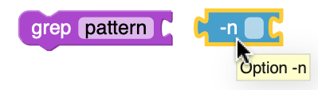
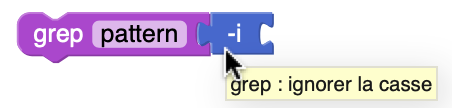
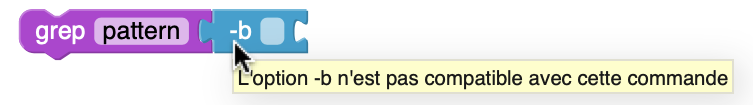
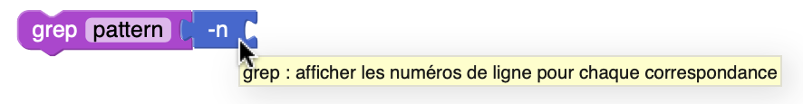
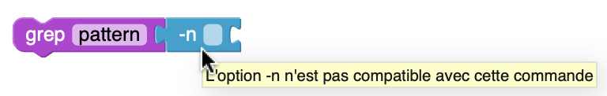

# Tooltips

Les **tooltips** aident l'utilisateur à comprendre à quoi servent les options des commandes Unix disponibles dans l'interface.

Quand une option est dans la boîte à outils ou dans l'espace de travail mais n'est rattachée à aucun bloc, le tooltip sera le nom de l'option.

| **Exemple :**                                     |
| ------------------------------------------------- |
|  |

Quand une option est attachée à une commande, elle va afficher dynamiquement un tooltip :

- Si l'option est compatible avec la commande, cela affichera une description spécifique.

| **Exemple :**                            |
| ---------------------------------------- |
|  |

- Sinon, cela affichera :
  "L'option -x n'est pas compatible avec cette commande"

| **Exemple :**                            |
| ---------------------------------------- |
|  |

## Correspondance

Dans la constante [`optionTooltips`](https://github.com/UnixFilters/unixfilters-franceIOI/blob/main/public/unixfilters.js#L375), chaque commande est associée à une liste d’options compatibles, classées selon leur type (flag ou field_index), par exemple :

```javascript title="unixfilters.js"
const optionTooltips = {
  grep: {
    n: {
      flag: "grep : afficher les numéros de ligne pour chaque correspondance",
    },
    i: {
      flag: "grep : ignorer la casse",
    },
  },
  head: {
    n: {
      field_index: "head : afficher les n premières lignes (par défaut : 10)",
    },
  },
  // ...
};
```

- La clé principale correspond au nom de la commande (grep, head, etc.).

- Chaque option (comme n, i, c, etc.) peut être définie avec une description par type :<br>
  → flag pour les options booléennes (ex : -i)<br>
  → field_index pour les options avec argument numérique ou positionnel (ex : -n 10)

## Cas particulier

L'affichage des tooltips repose sur la structure [`optionTooltips`](https://github.com/UnixFilters/unixfilters-franceIOI/blob/main/public/unixfilters.js#L375), qui associe à chaque commande ses options compatibles, en distinguant leur type (flag et field index).

Si une **même lettre d’option** (par exemple `-n`) est définie avec **des types différents** selon les commandes (`flag` pour `grep`, `field_index` pour `head`) :

- Lorsqu’on utilise une option de type `field_index` sur une commande où seule la version `flag` est valide, le système affiche un tooltip d’erreur :
  "L'option -n n'est pas compatible avec cette commande"

- Mais si aucune valeur n’est fournie avec cette option `field_index`, le système l’interprète comme un flag, ce qui fonctionne à l'exécution.

Le tooltip affiche une erreur incorrecte, alors que la commande est exécutée normalement.

| **Exemple :**                                        |
| ---------------------------------------------------- |
|         |
|  |
