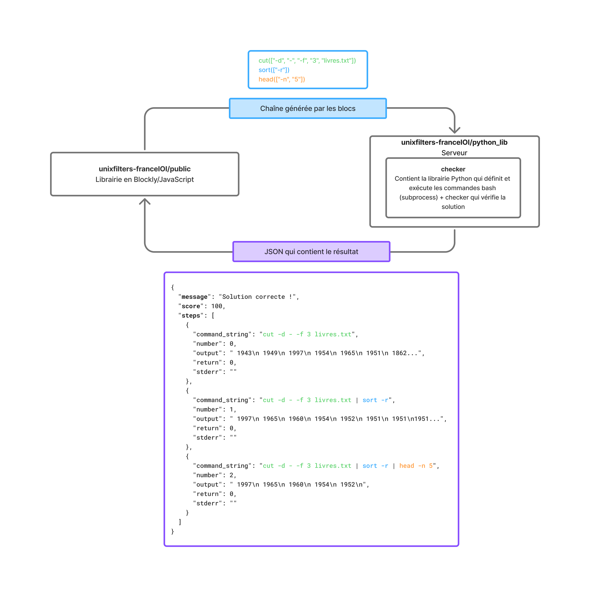

# Accueil

## Accès rapide

[Getting started](getting_started.md){ .md-button }
[Mettre en place une tâche](help/init_task.md){ .md-button }

## Architecture

|                                        |                                 |
| -------------------------------------- | ------------------------------- |
| De `unixfilters-franceIOI` → `checker` | Chaîne envoyée au format String |
| De `checker` → `unixfilters-franceIOI` | Réponse envoyée au format JSON  |

## Structure des dépôts

Le projet comporte deux dépôts principaux :

- **unixfilters-franceIOI** (JS/Blockly + back Python) — [Documentation du checker](./documentation_checker.md)
- **checker** (exécution et évaluation Python) — [Documentation de la librairie JavaScript](./jsdoc/index.html)
